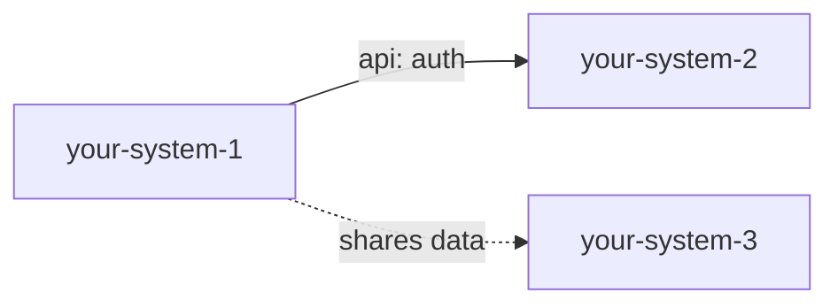

# System Map — <Project Name>

Single source of truth for how systems relate. The graph and register below are
reconciled with each system's `OVERVIEW.md` → Relationships by `audit`. Every edge
must resolve to a real system, and both endpoints should agree.

## Diagram



> Use `subgraph` clusters to group sub-systems under their parent:
> ```mermaid
> graph LR
>   subgraph van["van"]
>     electrical["electrical"]
>     climate["climate"]
>     insulation["insulation"]
>   end
>   workshop["workshop"]
>   workshop -.->|informs| van
>   electrical -.->|power| climate
> ```

> Solid arrow = one-way dependency (`→`); dashed / double = mutual (`↔`). Label
> each edge with its type.

## Relationships

| From | To | Type | Direction | Contract / notes |
|------|----|------|-----------|------------------|
| your-system-1 | your-system-2 | api | → | REST; contract TBD |
| your-system-1 | your-system-3 | shared-data | ↔ | shared schema |

## Conventions

- **Type** is defined by the active domain pack — see
  `references/domains/<domain>/system-types.md` → Relationship types. Software:
  `api | event-stream | shared-data | library | depends-on`. General / physical:
  `power | physical-adjacency | structural | data | depends-on | informs`.
- **Direction:** `→` one-way dependency, `↔` mutual.
- **Contracts are optional and emerge later.** When an edge needs a real contract
  (an API/event schema, a power-budget calc), create it as its own artifact that
  *both* systems link to; until then a note here suffices.
- `audit` (check 15) flags dangling edges, asymmetric edges, map/OVERVIEW drift,
  and systems with no relationships in a multi-system project.
