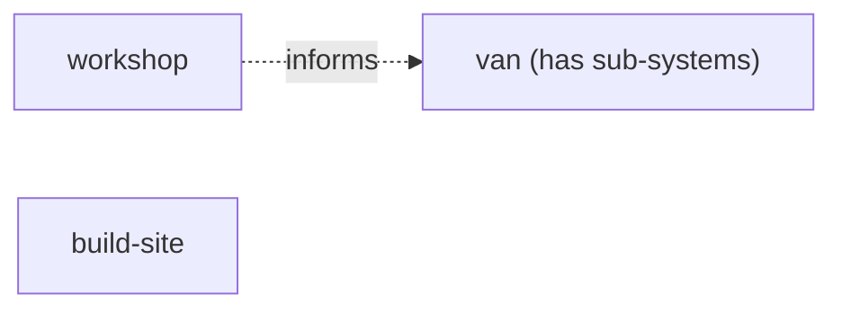
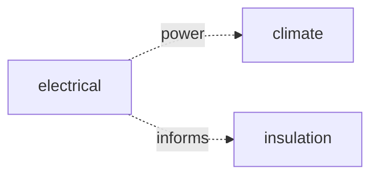

# System Map — <Project Name | System Name>

System maps show how systems relate. There are two levels:

- **Top-level** (`project/shared/system-map.md`): shows all top-level systems as
  nodes. Related systems have edges. Unrelated neighbours still appear as
  disconnected nodes (their presence is informational). Systems that have
  sub-systems are marked with a note or subgraph label. This is the bird's-eye
  view of the project.

- **Per-system** (`<system>/system-map.md`): for systems with sub-systems, shows
  the parent's children and how they relate to each other. This is the local
  detail that would clutter the top-level map. Links back to the parent
  `INDEX.md`. Not every system needs one — only systems with sub-systems (or
  with enough internal relationships to warrant a map).

Each system's `INDEX.md` Relationships table remains the local view for
that system. `audit` (check 15) reconciles across all levels: top-level map vs
per-system maps vs per-system INDEX relationships.

**System maps are Mermaid diagrams** — Mermaid renders natively in Obsidian,
GitHub, and most markdown viewers, so the map is always visible without extra
tooling. Use Mermaid's native arrow syntax in the diagram:

- `-->` solid arrow = one-way dependency
- `-.->` dashed arrow = softer / informational link
- `<-->` double arrow = mutual relationship

(Excalidraw is for spatial/physical drawings, not system maps — see
`references/agents/diagram.md`.)

## Top-level map (`project/shared/system-map.md`)



> Use `subgraph` clusters if you want to show sub-systems inline:
> ```mermaid
> graph LR
>   subgraph van["van"]
>     electrical["electrical"]
>     climate["climate"]
>     insulation["insulation"]
>   end
>   workshop["workshop"]
>   workshop -.->|informs| van
>   electrical -.->|power| climate
> ```
> For projects with many systems, prefer marking parents with `(has sub-systems)`
> and keeping sub-system detail in the per-system map.

## Per-system map (`<system>/system-map.md`)



> Label each edge with its type. See the arrow-syntax guide above.

## Relationships register

The register mirrors the diagram in text (for search and audit reconciliation).
Direction uses the same convention as the Mermaid arrows: `->` one-way, `<->`
mutual.

| From | To | Type | Direction | Contract / notes |
|------|----|------|-----------|------------------|
| your-system-1 | your-system-2 | api | -> | REST; contract TBD |
| your-system-1 | your-system-3 | shared-data | <-> | shared schema |

## Conventions

- **Type** is defined by the active domain pack — see
  `references/domains/<domain>/system-types.md` -> Relationship types. Software:
  `api | event-stream | shared-data | library | depends-on`. General / physical:
  `power | physical-adjacency | structural | data | depends-on | informs`.
- **Direction:** `->` one-way dependency, `<->` mutual.
- **Unrelated neighbours** appear as nodes with no edges. Their presence is
  informational — you can see what systems exist even if they don't connect.
- **Contracts are optional and emerge later.** When an edge needs a real contract
  (an API/event schema, a power-budget calc), create it as its own artifact that
  *both* systems link to; until then a note here suffices.
- `audit` (check 15) flags dangling edges, asymmetric edges, map/INDEX drift,
  hierarchy inconsistencies (parent/child maps out of sync), and systems with no
  relationships in a multi-system project.
